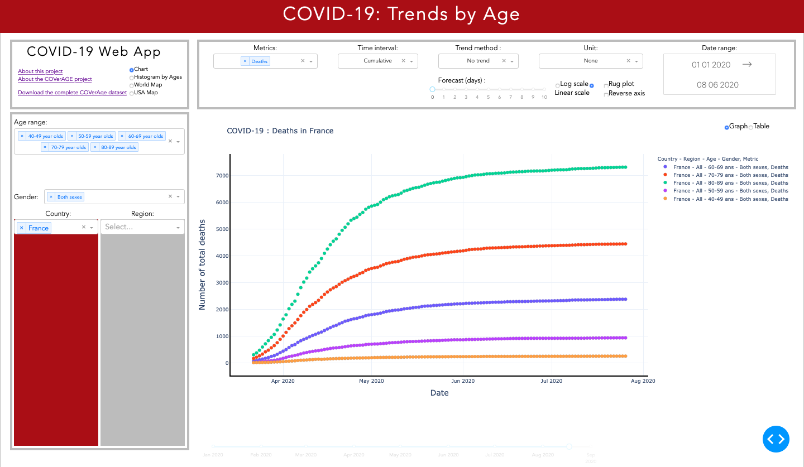
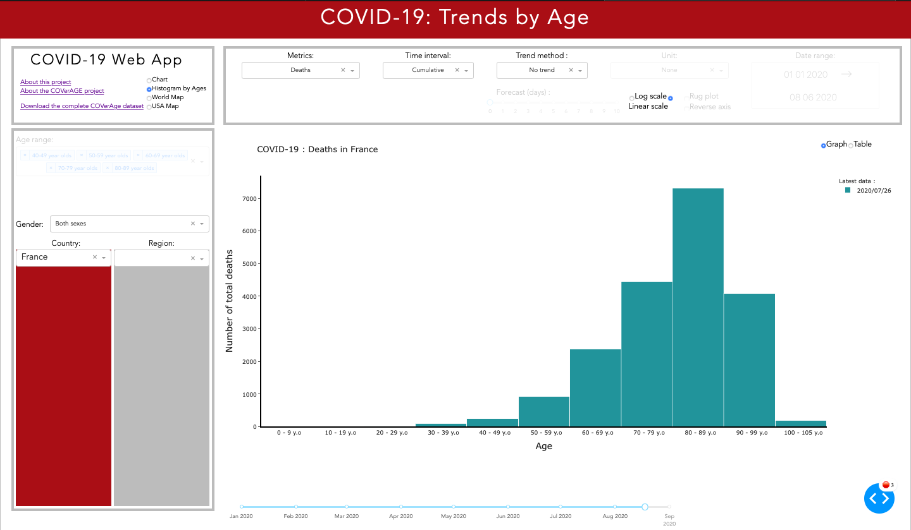
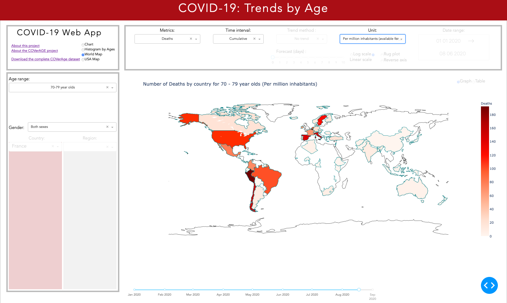
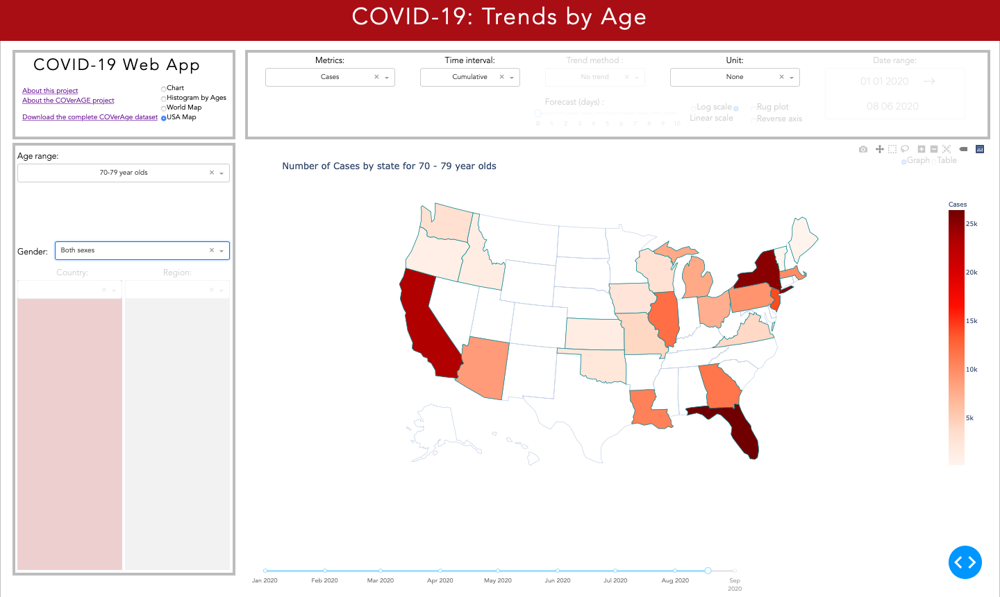

# COVID19: Trends by Age

Dash-based app

app.py can be run from terminal : it launches the application using the CSV file /data/data_preprocessed.py

Last processed data dates 2020/08/17

Ask me if you want me to process more recent data !

However you can also process it by yourself :

    * Download Output_10.csv from https://osf.io/mpwjq/
    * Run data_preprocessing.py from cmd (creates data/data_preprocessed_test.py)

Data visualisation project on Covid-19 cases, deaths by age bands

Main data source : https://osf.io/mpwjq/

# PROJECT OWNER

Lilian Marey

# SQUAD 

Lilian Marey

Jean-Claude Razafindrakoto

Marius Pascariu

# STRUCTURE OF PROJECT

COVID19_Trends_by_Age

    |
    |
    |---- data           : Datatabases we work with

            |
            |
            |--- population_datasets        : Databases used for weighting
            |
            |--- Output_10.csv              : The main database with the number of cases, deaths, tests, etc. by age and region
    |        
    |
    |---- documentation  : Documentation (resources, codebook)
    |
    |---- assets         : deals with the front end presentation
    |
    |---- src            : Documented scripts after iterations 
    |
    |---- app.py         : Web app in Dash 
    |
    |---- data_preprocessing.py         : Data processor to run before launching the app
    |
    |____ README.md      

# Screenshots

## Charts

## Histogram

## Maps

